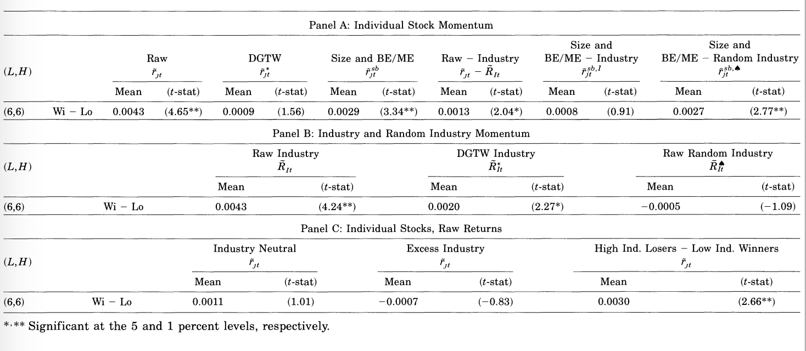
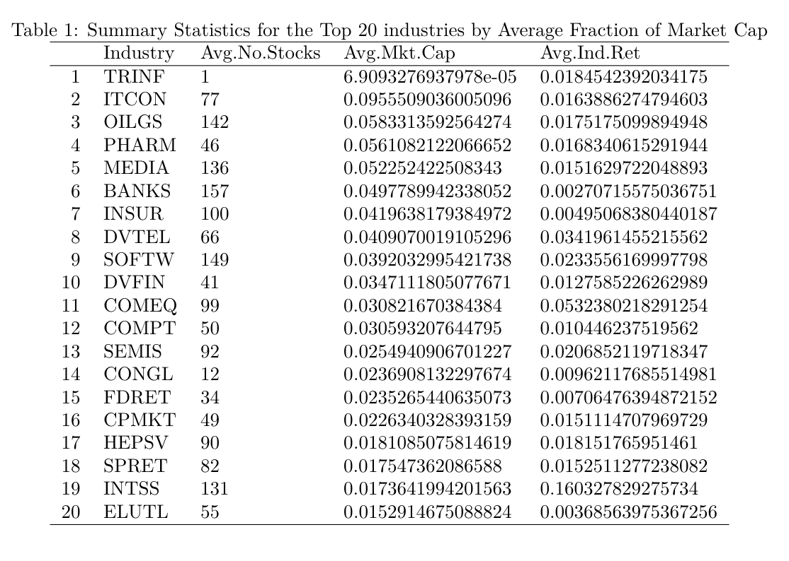
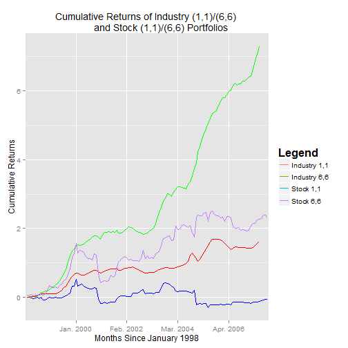

Do Industries Explain Momentum?
========================================================
author: James Reed Sawyers and Johnson Nei

January 28, 2015

Terminology
========================================================
- Momentum - A rise or fall in equity price based on previous changes in equity price.
- Individual stock momentum - The change in price of a single stock based upon previous changes in equity price.
- Industry Momentum - The change in price of an entire industry, which encompasses many equities in the same general business, based upon previous changes in equity price.  
- Selling Short - A way of profiting from the decline in price of a stock by borrowing it, selling it, and then buying it back for a hopefully lower price in the future. 
Terminology Cont. 
========================================================
- Momentum strategy - Buying past winners and shorting past losers. 
- Self Funding Portfolio - A portfolio in which the cash generated by your short sales is used to fund your long positions. (Generally a theoretical concept used to determine the effectiveness of a return generating strategy)
- R - A language used for data and statistical analysis

History
========================================================
- 1993-Jegadeesh and Titman found that an individual stock momentum strategy can yield significant returns in the intermediate term.
- 1999-Moskowitz and Grinblatt conclude industry momentum is the source of momentum trading profits. By looking at winning and losing industries instead of just stocks, they demonstrated that individual stock momentum is not as profitable after controlling industry momentum.

Moskowitz and Grinblatt's Findings
========================================================

Project Overview
========================================================
- Using US Large Cap. stocks between 1998-01-02 and 2007-11-28, we replicated Moskowitz and Grinblatt's results and found that industry momentum strategies indeed yield significant returns and account for most of the profits from individual stock momentum strategies.
- We also observed that industry momentum strategies yield different results based on the price of a specific industry.

Project Implementation
========================================================
- We used our data to create four portfolios, an Ind.(1,1),(6,6), Stock(1,1) and stock (6,6).
- (1,1) means that we would sort by the last month of returns and hold for a month. (6,6) means that we would sort the mean returns from the previous six months and hold for six months.
- Portfolios were generated on a rolling monthly basis, and due to the self-funding nature of the portfolio, the total portfolio return was the difference between the return of the long position and the return of the short position. 

Industries
========================================================

Individual Stock / Industry
========================================================

As you can see, our results show that Industry Momentum does produce much higher returns. It is also worth noting that returns are higher at the (6,6) level for both stocks, which holds with what is known of the stock momentum effect, and for industries. 

Stock/Industry (1,1) (6,6)
========================================================
 

Are Industry Returns Affected by Price?
========================================================
- Hypothesis: Higher priced stocks and industries will perform better than lower priced industries in our (6,6) portfolio, because higher priced stocks are less likely to be frauds or scams. 
- We tested this by breaking our industries and individual stocks down by their first recorded price and separating them into highly priced (top 30%) and low priced(bottom 30%) buckets. From both high and low we made (1,1)/(6,6) Industry, and (1,1)/(6,6) individual stock portfolios resulting in 8 total portfolios. 

Stock/Industry (1,1),(6,6) for Price
========================================================
  
- As expected, the (6,6) portfolio outperformed the (1,1) for each bucket, and the industry portfolios did better than the stock portfolios.
- Unexpectedly however, the lower priced buckets actually performed better, often dramatically better, than their higher priced counterparts. We believe this to be due to bias in our data set rather than due to the actual operations of the market. 

Conclusion
========================================================
- Industry Momentum is a stronger generator of returns than individual stock momentum.
- Both stocks and industries perform better at the (6,6) level.
- When seperated by price the above still holds true, but we beleive there is currently insignificent evidence to determine the effect of price in our model.

Credits
========================================================
We would like to thank the Professor David Kane and the teaching fellow Yuanchu Dang for their help on this paper. The code used to produce the results in the paper was written in R and is available on the Github account (jrs9) under the public repository (https://github.com/jrs9/Final-INDM). The package name is INDM. Contact David Kane at dave.kane@gmail.com for more information on the project.
